# Sistem Pemesanan Tiket Event — Berbasis Microservice

> UTS PPLOS B · NIM 2410511090 · Teknik Informatika · UPN "Veteran" Jakarta

[](https://nodejs.org)
[](https://laravel.com)
[](https://mysql.com)
[]()
[]()

---

## Daftar Isi

- [Identitas](#identitas)
- [Tentang Proyek](#tentang-proyek)
- [Arsitektur](#arsitektur)
- [Struktur Folder](#struktur-folder)
- [Prasyarat](#prasyarat)
- [Cara Menjalankan](#cara-menjalankan)
- [Peta Endpoint](#peta-endpoint)
- [Variabel Environment](#variabel-environment)
- [Screenshot Pengujian](#screenshot-pengujian)
- [Demo Video](#demo-video)

---

## Identitas

| | |
|---|---|
| **Nama** | *Muhammad Syahrul Pane* |
| **NIM** | 2410511090 |
| **Mata Kuliah** | Pemrograman Perangkat Lunak Berbasis Objek (PPLOS B) |
| **Semester** | 4 — Genap 2025/2026 |
| **Universitas** | UPN "Veteran" Jakarta |
| **Tag Submission** | `submission-v1` |

---

## Tentang Proyek

Sistem pemesanan tiket event yang dibangun menggunakan arsitektur **microservice** dengan 3 service independen dan 1 API Gateway. Sistem mendukung autentikasi berbasis **JWT** dan login alternatif via **Google OAuth 2.0** (Authorization Code Flow).

### Fitur Utama

- Registrasi dan login pengguna dengan JWT (access token 15 menit, refresh token 7 hari)
- Login via Google OAuth 2.0 dengan mapping ke user lokal
- CRUD event dengan kategori tiket (VIP, Regular, dll)
- Checkout tiket dengan validasi kuota real-time
- Konfirmasi pembayaran otomatis menerbitkan e-ticket + QR code
- Validasi QR code di pintu masuk event
- API Gateway: single entry point, JWT validation, rate limiting 60 req/menit

---

## Arsitektur

```
Client / Postman
      │
      ▼
API Gateway :8000
(JWT validation · Rate Limit · Routing)
      │
      ├──────────────┬──────────────┐
      ▼              ▼              ▼
auth-service    event-service  payment-service
   :3001            :3002           :3003
  Node.js        Laravel 11       Node.js
      │              │              │
      ▼              ▼              ▼
  auth_db        event_db       payment_db
  (MySQL)        (MySQL)         (MySQL)
```

### Stack Teknologi

| Service | Teknologi | Port | Database |
|---------|-----------|------|----------|
| auth-service | Node.js + Express | 3001 | auth_db |
| event-service | Laravel 11 (PHP MVC) | 3002 | event_db |
| payment-service | Node.js + Express | 3003 | payment_db |
| gateway | Node.js + Express | 8000 | — |

---

## Struktur Folder

```
uts-pplos-b-2410511090/
├── services/
│   ├── auth-service/
│   ├── event-service/
│   └── payment-service/
├── gateway/
├── postman/
│   └── collection.json
├── docs/
│   └── screenshots/         
├── poster/
└── README.md
```

---

## Prasyarat

| Tool | Versi Minimum | Cek |
|------|---------------|-----|
| Node.js | 18+ | `node -v` |
| PHP | 8.2+ | `php -v` |
| Composer | 2+ | `composer -v` |
| MySQL | 8.0+ | via XAMPP / Laragon |
| Git | 2+ | `git -v` |

---

## Cara Menjalankan

### 1. Clone Repository

```bash
git clone https://github.com/(username)/uts-pplos-b-2410511090.git
cd uts-pplos-b-2410511090
```

### 2. Setup auth-service

```bash
cd services/auth-service
npm install
cp .env.example .env
# Edit .env — isi DB_PASSWORD dan JWT_SECRET
node src/migrate.js
```

### 3. Setup event-service

```bash
cd services/event-service
composer install
cp .env.example .env
php artisan key:generate
# Edit .env — isi DB_DATABASE=event_db dan JWT_SECRET (sama dengan auth-service)
php artisan migrate
```

### 4. Setup payment-service

```bash
cd services/payment-service
npm install
cp .env.example .env
# Edit .env — isi DB_PASSWORD dan JWT_SECRET (sama dengan auth-service)
node src/migrate.js
```

### 5. Setup gateway

```bash
cd gateway
npm install
cp .env.example .env
# Edit .env — isi JWT_SECRET (sama dengan auth-service)
```

### 6. Jalankan Semua Service

Buka **4 terminal terpisah**:

```bash
# Terminal 1
cd services/auth-service
npm start

# Terminal 2
cd services/event-service
php artisan serve --port=3002

# Terminal 3
cd services/payment-service
npm start

# Terminal 4
cd gateway
npm start
```

### 7. Verifikasi

| Service | URL | Expected |
|---------|-----|----------|
| Gateway | http://localhost:8000/health | `{"status":"ok"}` |
| auth-service | http://localhost:3001/health | `{"status":"ok"}` |
| event-service | http://localhost:3002/api/health | `{"status":"ok"}` |
| payment-service | http://localhost:3003/health | `{"status":"ok"}` |

---

## Peta Endpoint

Semua request melalui **API Gateway port 8000**.

### Auth

| Method | Path | Auth | Status |
|--------|------|------|--------|
| POST | `/api/auth/register` | X | 201 |
| POST | `/api/auth/login` | X | 200 |
| POST | `/api/auth/refresh` | X | 200 |
| POST | `/api/auth/logout` |  JWT | 200 |
| GET | `/api/auth/me` |  JWT | 200 |
| GET | `/api/auth/oauth/google` | X | redirect |
| GET | `/api/auth/oauth/google/callback` | X | 200 |

### Events

| Method | Path | Auth | Status |
|--------|------|------|--------|
| GET | `/api/events` | X | 200 |
| GET | `/api/events/:id` | X | 200 |
| POST | `/api/events` |  JWT | 201 |
| PUT | `/api/events/:id` |  JWT | 200 |
| DELETE | `/api/events/:id` |  JWT | 204 |

### Tickets

| Method | Path | Auth | Status |
|--------|------|------|--------|
| GET | `/api/tickets` |  JWT | 200 |
| GET | `/api/tickets/:id` |  JWT | 200 |
| POST | `/api/tickets/validate-qr` |  JWT | 200 |

### Orders

| Method | Path | Auth | Status |
|--------|------|------|--------|
| GET | `/api/orders` |  JWT | 200 |
| GET | `/api/orders/:id` |  JWT | 200 |
| POST | `/api/orders` |  JWT | 201 |
| POST | `/api/orders/:id/confirm` |  JWT | 200 |
| DELETE | `/api/orders/:id` |  JWT | 200 |

---

## Variabel Environment

>  `JWT_SECRET` **wajib sama persis** di semua service dan gateway.

### auth-service `.env`

```env
PORT=3001
DB_HOST=localhost
DB_PORT=3306
DB_USER=root
DB_PASSWORD=
DB_NAME=auth_db
JWT_SECRET=isi_string_acak_minimal_32_karakter
JWT_EXPIRES_IN=15m
REFRESH_TOKEN_SECRET=isi_string_acak_berbeda_minimal_32_karakter
REFRESH_TOKEN_EXPIRES_IN=7d
GOOGLE_CLIENT_ID=isi_dari_google_cloud_console
GOOGLE_CLIENT_SECRET=isi_dari_google_cloud_console
GOOGLE_REDIRECT_URI=http://localhost:3001/api/auth/oauth/google/callback
```

### event-service `.env`

```env
DB_CONNECTION=mysql
DB_HOST=127.0.0.1
DB_PORT=3306
DB_DATABASE=event_db
DB_USERNAME=root
DB_PASSWORD=
JWT_SECRET=HARUS_SAMA_DENGAN_AUTH_SERVICE
```

### payment-service `.env`

```env
PORT=3003
DB_HOST=localhost
DB_PORT=3306
DB_USER=root
DB_PASSWORD=
DB_NAME=payment_db
JWT_SECRET=HARUS_SAMA_DENGAN_AUTH_SERVICE
EVENT_SERVICE_URL=http://localhost:3002
```

### gateway `.env`

```env
PORT=8000
AUTH_SERVICE_URL=http://localhost:3001
EVENT_SERVICE_URL=http://localhost:3002
PAYMENT_SERVICE_URL=http://localhost:3003
JWT_SECRET=HARUS_SAMA_DENGAN_AUTH_SERVICE
RATE_LIMIT_WINDOW_MS=60000
RATE_LIMIT_MAX=60
```

---

## Screenshot Pengujian

Semua pengujian dilakukan via **Postman** melalui API Gateway `http://localhost:8000`.

---

### 1. Register — `POST /api/auth/register`

> Response: **201 Created** — user baru berhasil dibuat

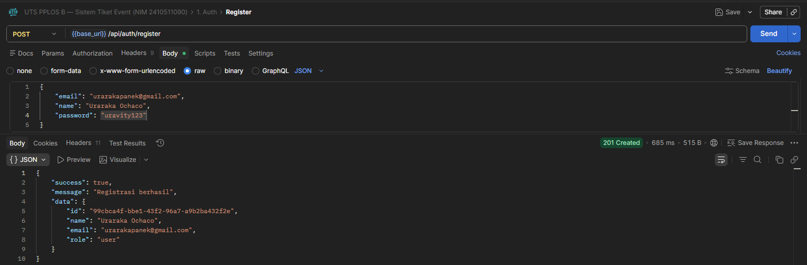

---

### 2. Login — `POST /api/auth/login`

> Response: **200 OK** — mengembalikan `access_token` (15 menit) dan `refresh_token` (7 hari)

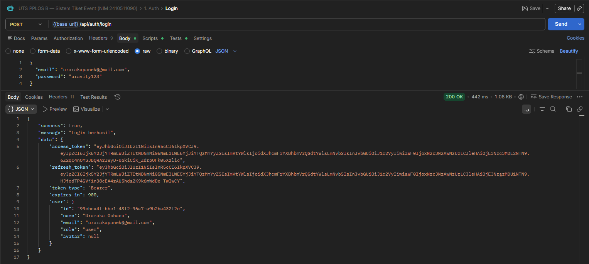

---

### 3. Get Profile — `GET /api/auth/me`

> Response: **200 OK** — JWT valid, data profil user berhasil diambil

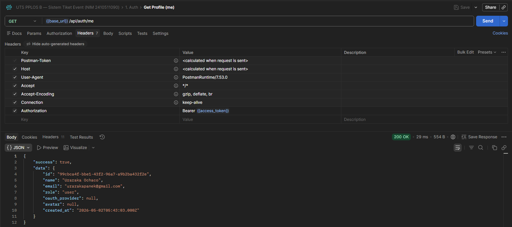

---

### 4. Refresh Token — `POST /api/auth/refresh`

> Response: **200 OK** — token rotation: refresh token lama dihapus, pasangan token baru diterbitkan

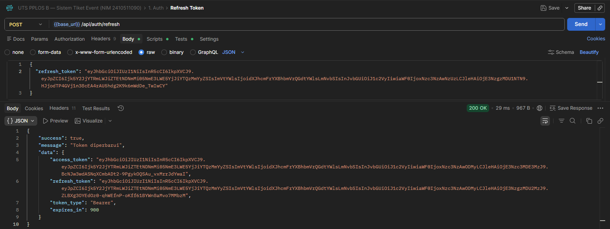

---

### 5. Logout — `POST /api/auth/logout`

> Response: **200 OK** — access token masuk blacklist, refresh token dihapus dari database

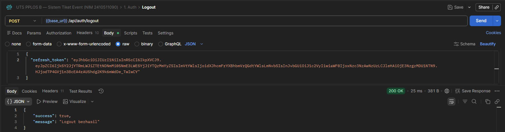

---

### 6. Google OAuth 2.0 — `GET /api/auth/oauth/google`

> Browser redirect ke halaman consent Google — **Authorization Code Flow** (`response_type=code`)

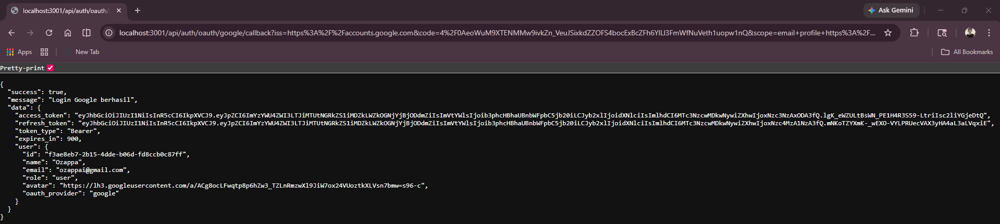

---

### 7. List Events — `GET /api/events`

> Response: **200 OK** — listing publik dengan paging (`page`, `per_page`) dan filtering (`status`, `search`)

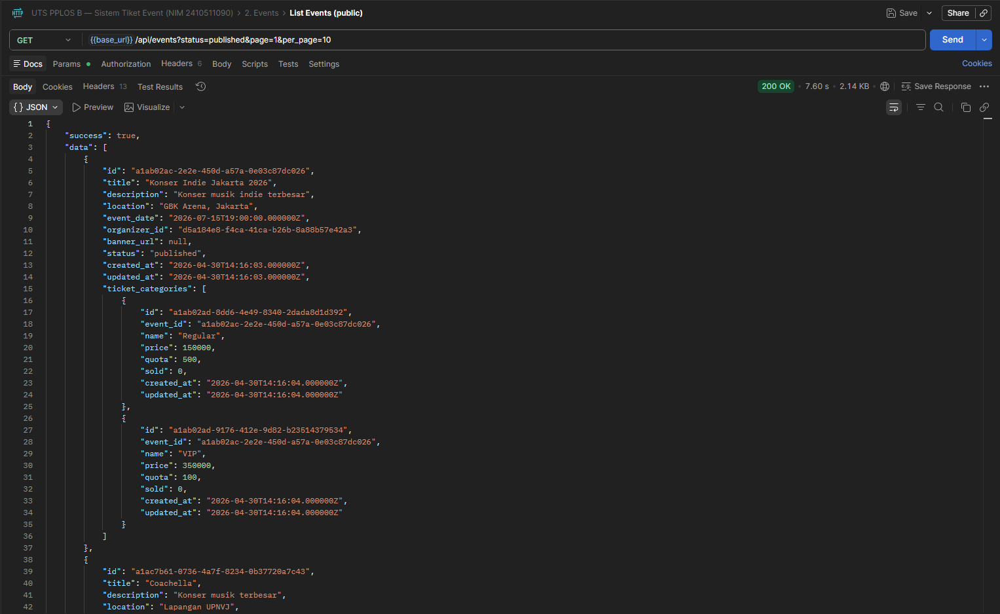

---

### 8. Create Event — `POST /api/events`

> Response: **201 Created** — event baru dengan kategori tiket (VIP + Regular)

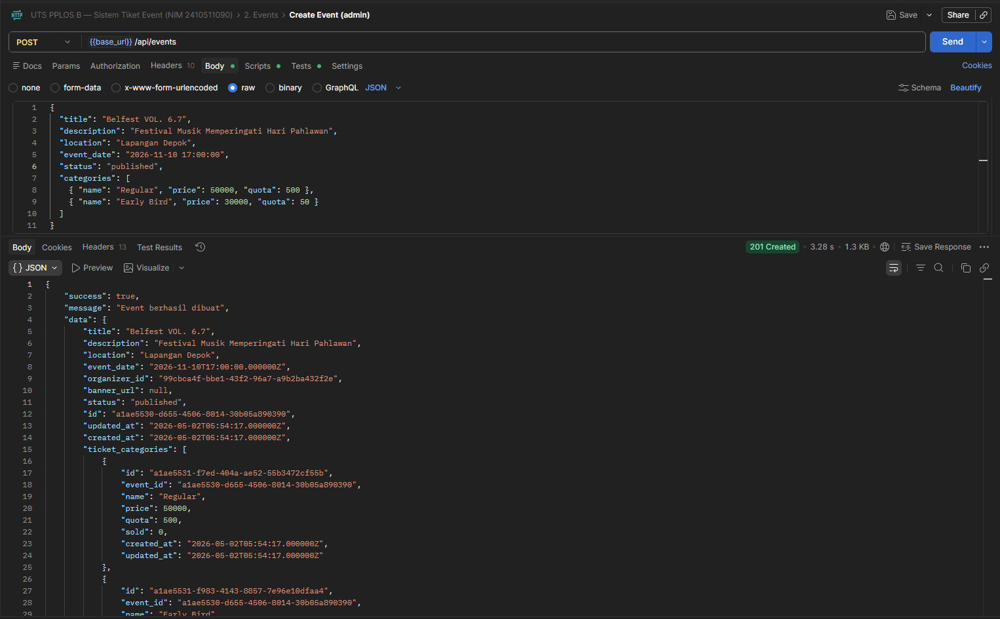

---

### 9. Detail Event — `GET /api/events/:id`

> Response: **200 OK** — menampilkan detail event

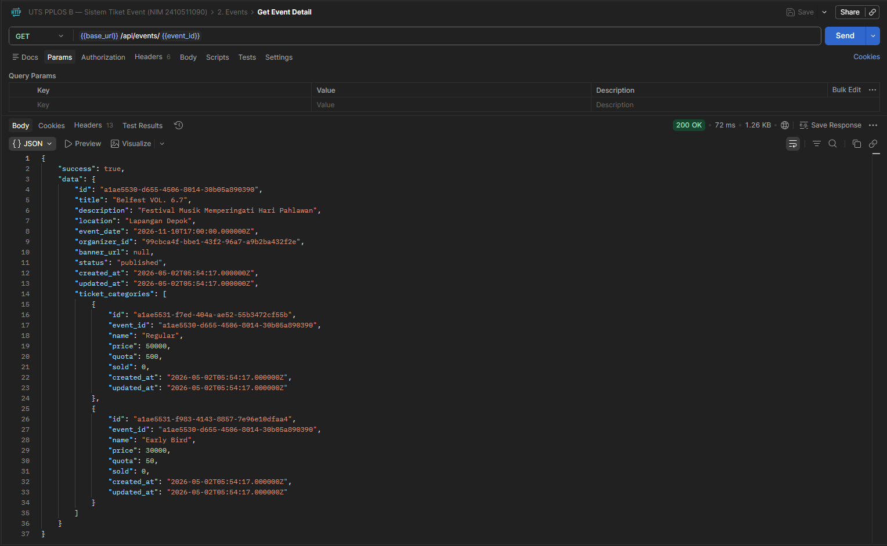

---

### 10. Update Event — `PUT /api/events/:id`

> Response: **200 OK** — mengubah event

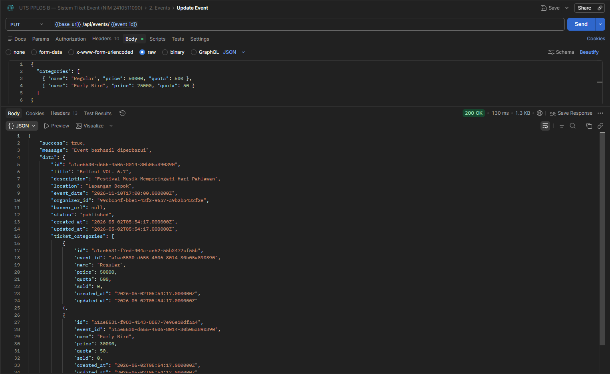

---

### 11. Checkout — `POST /api/orders`

> Response: **201 Created** — berhasil membuat order

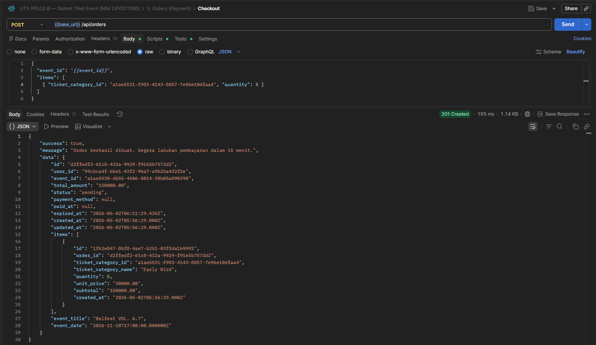

---

### 12. List Orders — `GET /api/orders`

> Response: **200 OK** — listing orders

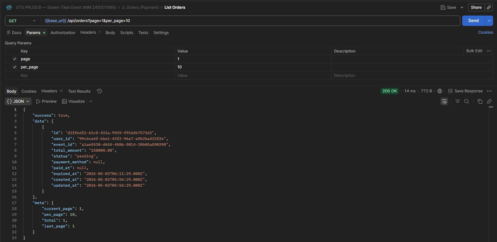

---

### 13. List Orders — `GET /api/orders/:id`

> Response: **200 OK** — menampilkan detail order

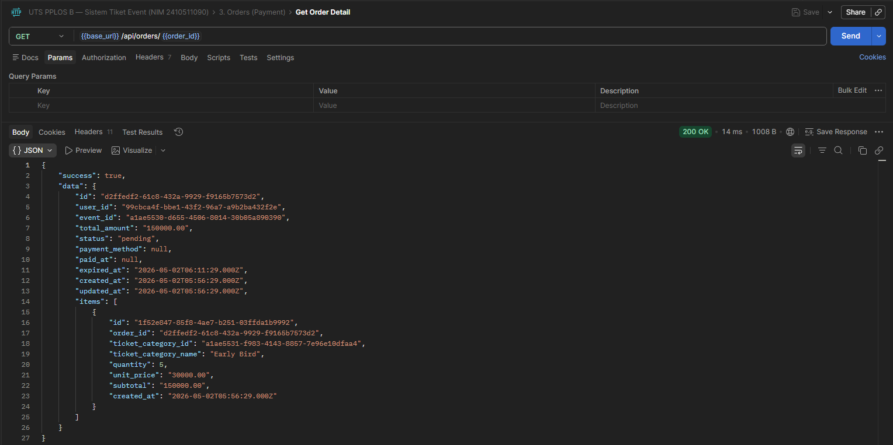

---

### 14. Confirm Payment — `POST /api/orders/:id/confirm`

> Response: **200 OK** — mengonfirmasi pembayaran berhasil dilakukan

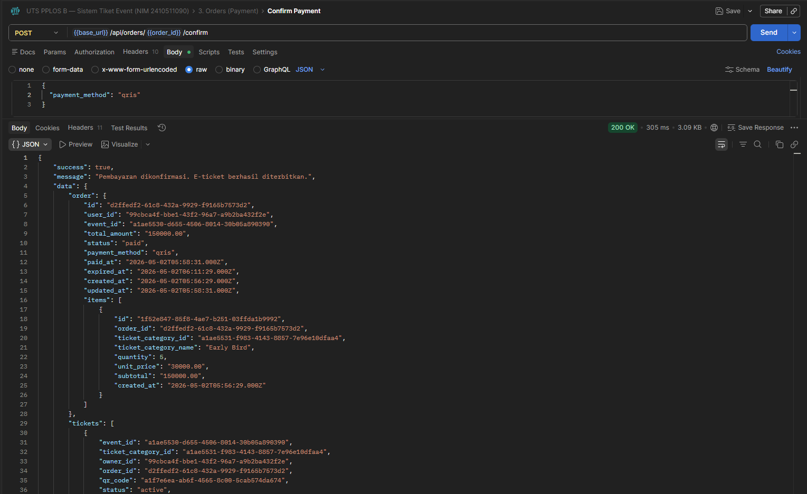

---

### 15. Cancel Order — `DELETE /api/orders/:id`

> Response: **200 OK** — mengonfirmasi order berhasil dibatalkan

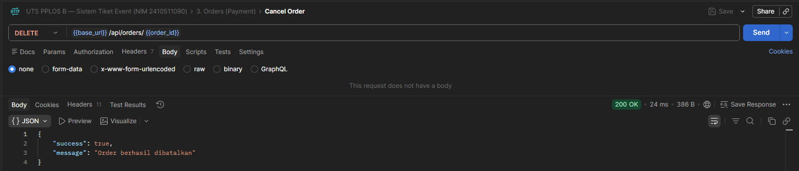

---

### 16. Listing Ticket — `GET /api/tickets`

> Response: **200 OK** — Listing ticket yang sudah dipesan

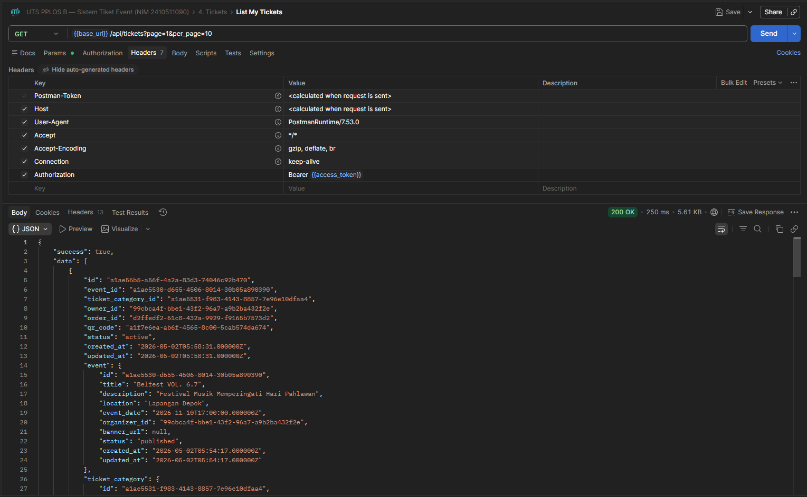

---
### 17. Validate QR Code — `POST /api/validate-qr`

> Response: **200 OK** — memvalidasi qr code tiket

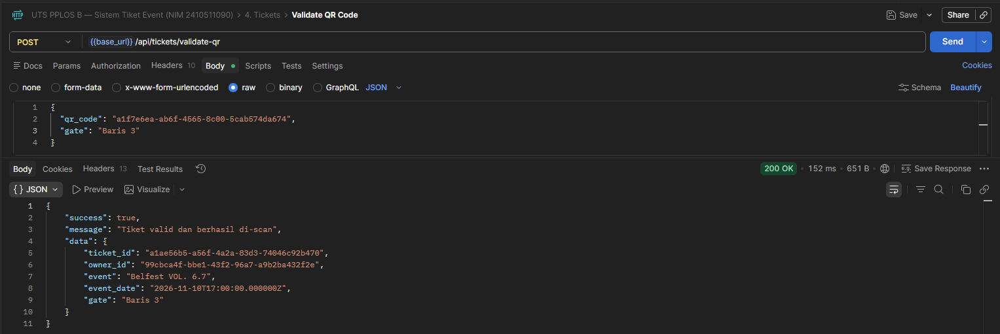

---

## Demo Video

 **[Tonton Demo di YouTube](https://youtu.be/B2ptPWFhzis)**
---